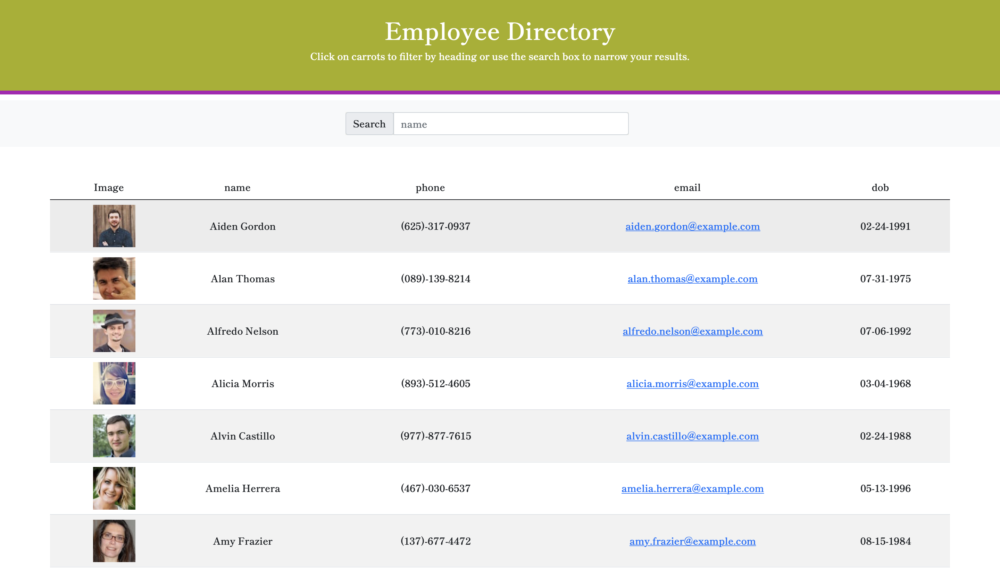

# React Employee Directory

## Description

- This app utilizes an API to populate random users and then create a directory. Other users on the app can search for employees by "name" and also organize each field (Name, Email, DOB) in ascending or descending order.

## App View

## Link

- Heroku:

## Directions

- Copy and paste the repository and in the project directory, you can run:

- npm start

* Runs the app in the development mode.
* Open http://localhost:3000 to view it in the browser.

- The page will reload if you make edits. You will also see any lint errors in the console.

## API used:

- randomuser.me

## User Story

- As a user, I want to be able to view my entire employee directory at once so that I have quick access to their information.

## Business Context

An employee or manager would benefit greatly from being able to view non-sensitive data about other employees. It would be particularly helpful to be able to filter employees by name.
